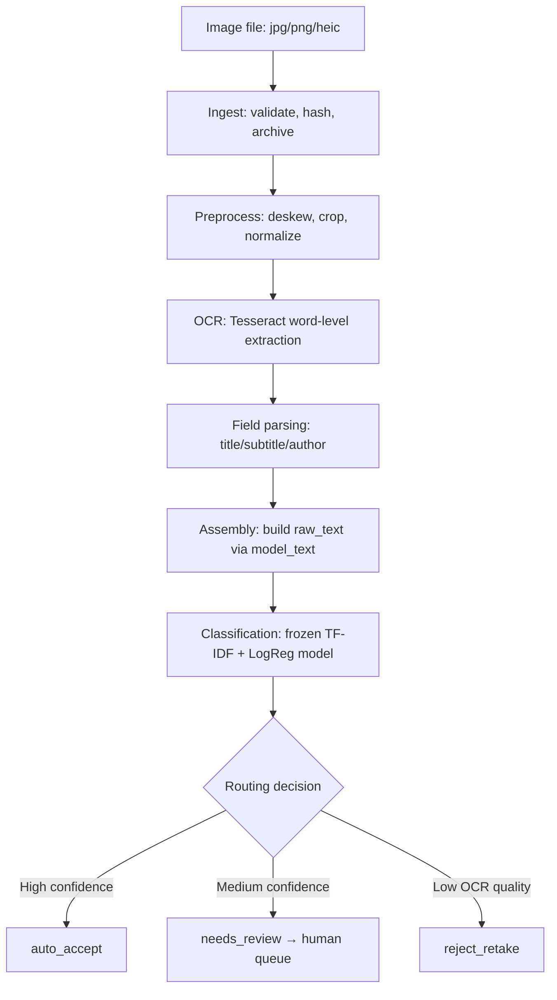

# OCR Pipeline — scanned book pages to DDC classification

**This pipeline sits in front of the existing ETL.** It takes a photographed or scanned book page and produces a classification-ready `raw_text` string, a predicted DDC broad class, and a routing decision. It does not replace any existing data preparation.

## Scope

The pipeline accepts images of book covers, spines, or title pages and produces:

1. Extracted text with per-word OCR confidence.
2. Parsed candidate fields (title, subtitle, author) with per-field confidence.
3. A `raw_text` string in the same shape the existing model expects (see [DATA_DICTIONARY.md](docs/DATA_DICTIONARY.md)).
4. A predicted DDC broad class (one of the ten existing labels: `000`–`900`).
5. A routing decision: `auto_accept`, `needs_review`, or `reject_retake`.

## Non-goals

- No automatic retraining loop. The model is loaded as a frozen artifact.
- No L2/L3 (detailed Dewey) prediction — the ten broad classes per existing scope only.
- No silent auto-filing of `needs_review` items — a human must act on them.
- No new label taxonomy or scope change.
- No cloud OCR by default — all processing is local (Tesseract).

## Quick start

```sh
# Install dependencies
pip install -r requirements.txt

# Train the baseline model (one-time prerequisite)
python -m src.ocr_pipeline.train_baseline

# Run the pipeline on a single image
python -c "
from src.ocr_pipeline.pipeline import run_pipeline
result = run_pipeline('path/to/book_photo.jpg')
print(result.classification.predicted_label, result.routing.outcome.value)
"

# Run the test suite
pytest tests/ -v --tb=short
```

Tesseract OCR must be installed separately. On Windows: download from [UB Mannheim](https://github.com/UB-Mannheim/tesseract/wiki). On Linux: `sudo apt install tesseract-ocr`. On macOS: `brew install tesseract`.

## Pipeline stages



Each stage is an independently testable module in `src/ocr_pipeline/`. Errors at any stage raise typed exceptions — no stage silently swallows an error into a default value.

## Configuration

All thresholds and paths are in [`pipeline_config.yaml`](pipeline_config.yaml). No magic numbers appear in code.

| Setting | Default | Meaning |
|---|---|---|
| `routing.classification_auto_accept_threshold` | 0.85 | Classification confidence >= this AND OCR OK → auto_accept |
| `routing.classification_needs_review_threshold` | 0.50 | Below auto_accept but above this → needs_review |
| `routing.ocr_reject_threshold` | 40 | Mean OCR confidence below this → reject_retake |
| `ocr.min_mean_confidence` | 60 | OCR quality floor for auto_accept |
| `ocr.min_word_confidence` | 40 | Individual word quality flag |

### Forbidden model features

The config lists every field that must never reach the model at inference time. This list is checked at runtime (hard assertion) and in automated tests. It mirrors the exclusion rules in [README.md §183](README.md).

## Module map

| Module | Stage | Purpose |
|---|---|---|
| `ingest.py` | §2.1 | Format validation, SHA-256 hashing, archival |
| `preprocess.py` | §2.2 | Deskew, text-region crop, contrast normalization |
| `ocr.py` | §2.3 | Tesseract OCR with word-level confidence |
| `field_parser.py` | §2.4 | Rule-based title/subtitle/author extraction |
| `assemble.py` | §2.5 | Reuses `model_text()` from `etl.py` |
| `classify.py` | §2.6 | Loads frozen model, feature leakage guard |
| `router.py` | §2.7 | Three-outcome routing with audit logging |
| `review.py` | §2.8 | Append-only correction records |
| `pipeline.py` | — | Orchestrator chaining all stages |
| `leakage_checks.py` | §3 | Automated leakage prevention |
| `train_baseline.py` | — | Separate model training (not part of pipeline) |
| `config.py` | — | YAML config loader with validation |
| `schemas.py` | — | Typed dataclasses for all inter-stage data |
| `exceptions.py` | — | Typed exceptions for each failure mode |

## raw_text composition

The `raw_text` string is assembled by importing `model_text()` from `src/ddc_data/etl.py` — the single source of truth. The composition is:

```
title
[subtitle, if present and not redundant with title]
[first_sentence, if available]
[Subjects: s1; s2; ..., if available]
```

For OCR input, `first_sentence` and `subject_headings` are almost always absent (they come from catalog metadata, not book covers). The pipeline explicitly tracks which fields are present vs. absent.

## Baseline model

The baseline classifier is TF-IDF + Logistic Regression, trained on the existing 5,034 examples with `split_group_id`-aware splitting:

- **TF-IDF**: up to 20,000 features, unigrams and bigrams, sublinear TF
- **Logistic Regression**: multinomial, balanced class weights, L2 regularization

The model is serialized to `models/baseline_classifier.joblib` (gitignored). Retrain with:

```sh
python -m src.ocr_pipeline.train_baseline
```

### Calibration note

The model's `predict_proba()` outputs are **NOT calibrated probabilities**. Logistic regression outputs are closer to calibrated than most classifiers, but no explicit calibration (e.g., `CalibratedClassifierCV`) has been applied. The `ClassificationResult.calibrated` flag is set to `False` and the `calibration_note` field documents this explicitly. Routing thresholds in `pipeline_config.yaml` account for this.

## Security

- OCR text is **untrusted input**: never executed, never interpolated unsanitized into shell commands, SQL queries, or templates.
- No API keys or credentials are committed to the repo. The `.pre-commit-config.yaml` includes a `detect-secrets` hook.
- All processing is local (Tesseract). No image data leaves the local environment by default.
- If a cloud OCR path is added later, the images in question may include copyrighted book covers — this requires explicit sign-off per the README's existing copyright concern.

## Frontend wiring notes

The pipeline returns a `PipelineResult` dataclass. A reviewer frontend would need the following API shape:

### Pipeline → Frontend (GET /review-queue)

```json
{
  "pipeline_id": "uuid",
  "ocr_text": "The Great Gatsby",
  "predicted_label": "800",
  "prediction_confidence": 0.87,
  "all_probabilities": {"000": 0.01, "100": 0.02, ..., "800": 0.87, "900": 0.01},
  "routing_outcome": "needs_review",
  "routing_reason": "Classification confidence below auto_accept threshold",
  "parsed_title": "The Great Gatsby",
  "parsed_subtitle": "",
  "parsed_author": "F. Scott Fitzgerald",
  "raw_text": "The Great Gatsby",
  "text_availability": "title_only",
  "original_filename": "book_photo.jpg",
  "content_hash": "abc123..."
}
```

### Frontend → Pipeline (POST /review/{pipeline_id}/correct)

```json
{
  "reviewer_id": "reviewer_username",
  "corrected_label": "700",
  "correction_reason": "Book is about art, not literature",
  "action": "corrected"
}
```

The `review.py` module's `persist_for_review()` and `record_correction()` functions already implement this data shape. A REST wrapper (Flask/FastAPI) would be a thin layer on top.

### What the pipeline currently returns vs. what the frontend needs

| Pipeline returns | Frontend needs | Status |
|---|---|---|
| `PipelineResult` dataclass | JSON via REST API | Needs REST wrapper |
| Review file as JSON on disk | Database or queue backend | Currently file-based |
| Append-only corrections | Same | Implemented |
| Image archive path | Image serving endpoint | Needs static file server |
| Processing log | Optional debug view | Available in PipelineResult |

## Known limitations

> [!WARNING]
> These are honest limitations. Do not treat this pipeline as production-ready without addressing them.

- **Not tested on real book photos.** Golden file tests use synthetic Pillow-generated images with rendered text. Real photos will have varying lighting, angles, fonts, and noise that these tests do not cover.
- **Not tested on handwritten text.** Tesseract is designed for printed text. Handwritten annotations, inscriptions, or titles will produce garbage.
- **Tesseract accuracy on phone photos is lower than on flatbed scans.** Phone photos have perspective distortion, motion blur, and uneven lighting that degrade OCR quality.
- **Non-Latin script detection is best-effort.** Tesseract's OSD mode detects scripts, but coverage is inconsistent for mixed-script content (e.g., a title in Arabic with an English subtitle).
- **Classification uses uncalibrated probabilities.** See the calibration note above.
- **Cloud OCR path is not implemented.** The pipeline uses local Tesseract only. Adding Google Cloud Vision or AWS Textract requires implementing the abstract interface and addressing the copyright concern.
- **Field parser is rule-based and fragile.** The heuristic parser uses font size and position to guess title/subtitle/author. It will fail on non-standard layouts (e.g., vertical text, circular designs, overlapping elements).
- **OCR input is much thinner than catalog metadata.** Most existing training examples have subject headings (39%) and some have first sentences (2%). OCR input typically has only title and maybe subtitle. Model accuracy on title-only input should be evaluated separately.
- **No load testing.** Pipeline throughput has not been measured. Tesseract is CPU-bound and single-threaded by default.
- **HEIC support requires pillow-heif.** If `pillow-heif` is not installed, HEIC images will fail at preprocessing with a clear error.
